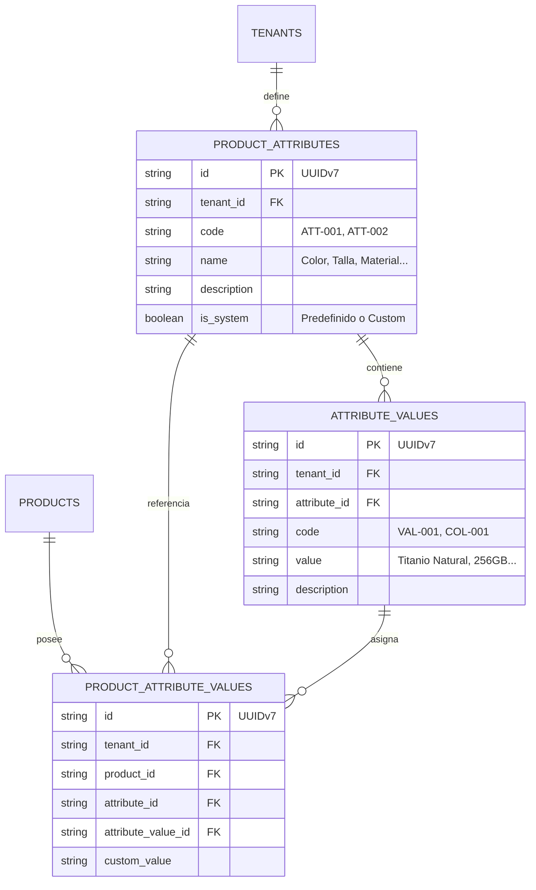

# Patron de Diseño: Atributos Maestros Dinámicos (Master Attribute-Value Pattern)

## Contexto & Problema
En plataformas de e-commerce multi-tenant, los productos varían enormemente según el rubro de la tienda:
- **Tecnología**: Modelo, Color, Almacenamiento/Talla, Material, Garantía, Voltaje.
- **Moda / Calzado**: Color, Talla, Género, Colección, Material.
- **Alimentos**: Peso, Presentación, Fecha de Vencimiento.

Hardcodear columnas o tablas SQL individuales para cada característica (ej. `table_colors`, `table_sizes`, `table_materials`) crea una trampa de diseño que viola el principio **Open/Closed (SOLID)**. Requiere migraciones continuas y refactorización constante de UI.

---

## Solución Arquitectónica
Adoptamos el patrón **Master Attribute-Value (EAV Mejorado para Multi-Tenant)**:

### 1. Modelo de Datos (Drizzle ORM + SQLite)

---

## Estructura de Identificadores y Códigos

1. **ID Interno (PK Global)**: `UUIDv7` (Ordenable cronológicamente, libre de colisiones).
2. **Código de Atributo**: Prefijo `ATT-` + Incremental (ej. `ATT-001` para Color, `ATT-002` para Talla).
3. **Código de Valor**: Prefijo basado en el atributo o general `VAL-` + Incremental (ej. `COL-001` para Titanio Natural).

---

## Flujo de Datos & Frontend (React + Query)

1. **Gestión Unificada**: El módulo de Catálogo cuenta con la pestaña **"Atributos & Valores"**, permitiendo administrar los atributos activos y sus opciones maestras.
2. **Formulario Dinámico de Productos**:
   - Al abrir el modal de creación, se obtienen los atributos del tenant mediante `useAttributes()`.
   - Se renderizan selectores dinámicos con auto-sugerencias y lazy-load.
   - Si un valor no existe, el usuario puede crearlo al vuelo de forma transparente.
3. **Optimización de Lectura / Caching**:
   - `staleTime` de 5 minutos para listas de atributos.
   - Contadores automáticos de uso (`productCount`) por cada valor de atributo.
